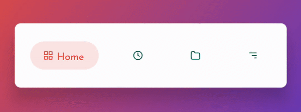

# BubbleTabBar

BubbleTabBar is bottom navigation bar with customizable bubble like tabs

[](https://android-arsenal.com/details/1/7841)
[](https://jitpack.io/#akshay2211/BubbleTabBar)
[](https://android-arsenal.com/api?level=21)



## Usage
 
```xml
    <com.fxn.BubbleTabBar
               android:id="@+id/bubbleTabBar"
               android:layout_width="match_parent"
               android:layout_height="wrap_content"
               android:background="#FFF"
               android:elevation="16dp"
               android:padding="7dp"
               app:bubbletab_menuResource="@menu/list"
               app:bubbletab_custom_font="@font/opensans"
               app:bubbletab_disabled_icon_color="@color/colorPrimaryDark"
               app:bubbletab_horizontal_padding="20dp"
               app:bubbletab_icon_size="20dp"
               app:bubbletab_title_size="16sp"
               app:bubbletab_icon_padding="5sp"
               app:bubbletab_vertical_padding="10dp">
       </com.fxn.BubbleTabBar>
```
or just use
```xml
    <com.fxn.BubbleTabBar
               android:id="@+id/bubbleTabBar"
               android:layout_width="match_parent"
               android:layout_height="wrap_content"
               android:padding="7dp"
               app:bubbletab_menuResource="@menu/list">
       </com.fxn.BubbleTabBar>
```
inflate menu list
```xml
<menu xmlns:android="http://schemas.android.com/apk/res/android">
    <item
        android:id="@+id/home"
        android:icon="@drawable/ic_grid"
        android:title="Home"
        android:checked="true"
        android:color="@color/home"/>

    <item
        android:id="@+id/log"
        android:icon="@drawable/ic_clock"
        android:title="Logger"
        android:color="@color/logger"/>
</menu>
            
```

add onclick listener 

```kotlin
   bubbleTabBar.addBubbLeListener(object : OnBubbleClickListener{
               override fun onBubbleClick(id: Int) {
                   
               }
           })
```
### connect with components like [ViewPager](https://github.com/akshay2211/BubbleTabBar/blob/master/README.md#setup-viewpager-to-bubbletabbar), [ViewPager2](https://github.com/akshay2211/BubbleTabBar#setup-viewpager2-to-bubbletabbar) and [NavController](https://github.com/akshay2211/BubbleTabBar#setup-navcontroller-to-bubbletabbar)
#### setup viewpager to BubbleTabBar

```kotlin

    viewPager.addOnPageChangeListener(object : ViewPager.OnPageChangeListener {
            override fun onPageScrolled(
                position: Int,
                positionOffset: Float,
                positionOffsetPixels: Int
            ) {

            }

            override fun onPageSelected(position: Int) {
                bubbleTabBar.setSelected(position, false)
            }

            override fun onPageScrollStateChanged(state: Int) {
            }
        })
   
```

#### setup viewpager2 to BubbleTabBar

```kotlin

    viewPager2.registerOnPageChangeCallback(object : ViewPager2.OnPageChangeCallback() {
                               override fun onPageSelected(position: Int) {
                                   super.onPageSelected(position)
                                   bubbleTabBar.setSelected(position)
                               }
                           })

```

#### setup NavController to BubbleTabBar

*onNavDestinationSelected* can be found in [here](https://github.com/akshay2211/BubbleTabBar/blob/cad8bdc3b634410c4d76c99853016e955f9fac70/app/src/main/java/com/fxn/bubbletabbarapp/utils/Helper.kt#L36)

```kotlin

    bubbleTabBar.addBubbleListener { id ->
                bubbleTabBar.onNavDestinationSelected(id, navController)
            }
    navController.addOnDestinationChangedListener { _, destination, _ ->
                bubbleTabBar.setSelectedWithId(destination.id, false)
            }

```

### Java Implementation
for [Java-Implementation](https://github.com/akshay2211/BubbleTabBar/wiki/Java-Implementation)

## Credits
Thanks to [Ariana](https://github.com/akshay2211/Ariana) for transition in sample

## IOS

Similar library [BubbleTabBar](https://github.com/Cuberto/bubble-icon-tabbar) by [Cuberto](https://github.com/Cuberto)

## Download

[](https://bintray.com/fxn769/android_projects/BubbleTabBar/1.0.3/link)

 include in app level build.gradle
 ```groovy
        repositories {
           maven { url 'https://jitpack.io' }
        }
 ```
```groovy
        implementation  'com.fxn769:bubbletabbar:1.0.6'
```
or Maven:
```xml
        <dependency>
            <groupId>com.fxn769</groupId>
            <artifactId>bubbletabbar</artifactId>
            <version>1.0.6</version>
            <type>pom</type>
        </dependency>
```
or ivy:
```xml
        <dependency org='com.fxn769' name='bubbletabbar' rev='1.0.6'>
            <artifact name='bubbletabbar' ext='pom' ></artifact>
        </dependency>
```

## License
Licensed under the Apache License, Version 2.0, [click here for the full license](/LICENSE).

## Author & support
This project was created by [Akshay Sharma](https://akshay2211.github.io/).

> If you appreciate my work, consider buying me a cup of :coffee: to keep me recharged :metal: by [PayPal](https://www.paypal.me/akshay2211)

> I love using my work and I'm available for contract work. Freelancing helps to maintain and keep [my open source projects](https://github.com/akshay2211/) up to date!
